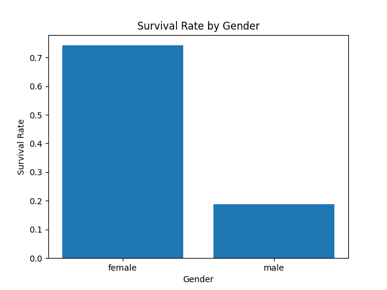
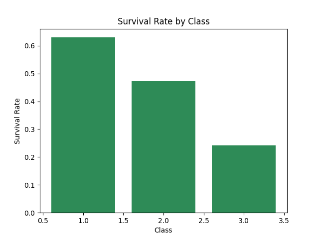
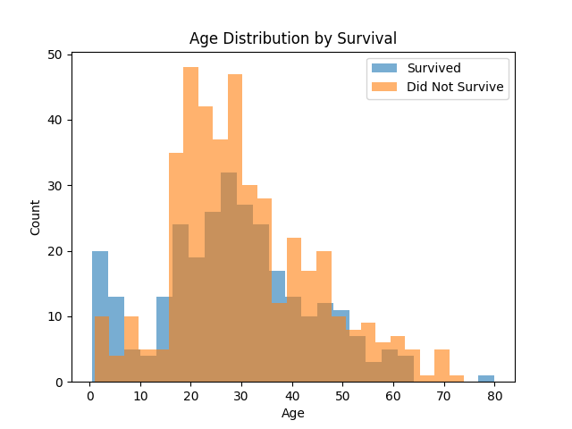
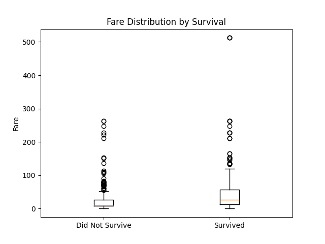
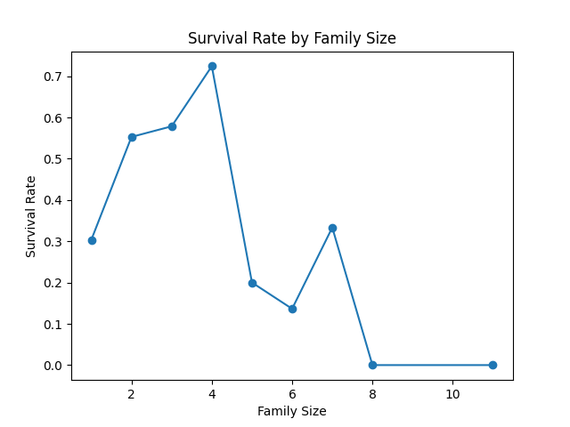
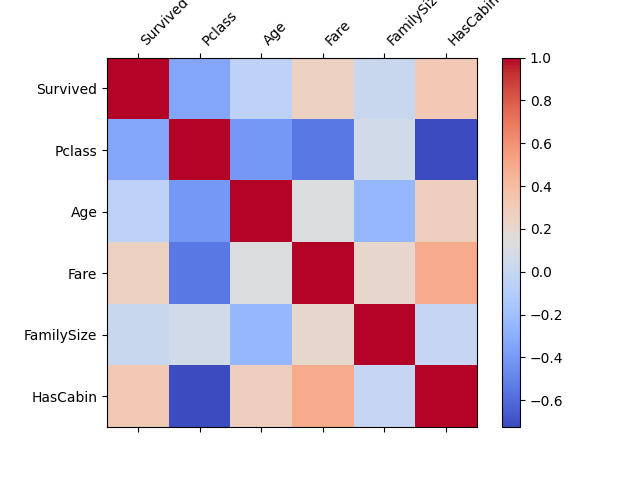

# Titanic Survival Analysis

## Description
This project analyzes the Titanic passenger dataset to understand which factors — gender, passenger class, family status, and age — influenced survival during the disaster. Working from a Data Analyst perspective, the goal was to clean the raw data, engineer meaningful features, explore patterns, and translate the findings into clear, business-style insights.

## Dataset
Source: [Titanic Dataset](https://raw.githubusercontent.com/datasciencedojo/datasets/master/titanic.csv)

**Key columns:**
- `Survived` → Survival status (0 = No, 1 = Yes)
- `Pclass` → Passenger class (1st, 2nd, 3rd)
- `Sex`, `Age` → Demographics
- `SibSp`, `Parch` → Number of siblings/spouses and parents/children aboard
- `Fare` → Ticket fare
- `Embarked` → Port of embarkation
- `Cabin` → Cabin number (mostly missing)

## Tools Used
Python | Pandas | NumPy | Matplotlib | Google Colab

## Steps Performed

**1. Data Quality Assessment**
- Audited missing values: `Age` (19.87%), `Cabin` (77.10%), `Embarked` (0.22%)
- Checked for duplicate rows (none found)

**2. Data Cleaning**
- Filled `Age` using the median grouped by passenger class (more accurate than a single global median)
- Filled `Embarked` with the most frequent port
- Converted `Cabin` into a binary flag `HasCabin` instead of dropping it, since its presence itself carries information
- Removed irrelevant columns (`Ticket`, `PassengerId`)

**3. Feature Engineering**
- Created `FamilySize` (siblings + parents + self)
- Created `IsAlone` flag for solo travelers
- Extracted `Title` (Mr, Mrs, Miss, Master, etc.) from passenger names

**4. Exploratory Data Analysis**
- Compared survival rates across gender, class, family status, and cabin availability
- Built a correlation matrix to identify the strongest numeric predictors of survival

**5. Probability Analysis**
- Calculated conditional survival probabilities (e.g., survival given gender, class, or age group)

**6. Visualization**
- Created 6 charts covering survival by gender, class, age distribution, fare, family size, and a correlation heatmap

## Key Statistics
| Metric | Value |
|---|---|
| Overall Survival Rate | 38.38% |
| Mean Age | 29.07 |
| Mean Fare | 32.20 |

## Probability Results
| Condition | Survival Probability |
|---|---|
| Overall | 38.38% |
| Female | 74.20% |
| Male | 18.89% |
| 1st Class | 62.96% |
| 3rd Class | 24.24% |
| Child (under 12) | 57.35% |

## Visualizations

*Women survived at a far higher rate than men.*

*Survival dropped sharply from 1st to 3rd class.*

*Age distribution compared between survivors and non-survivors.*

*Survivors generally paid higher fares.*

*Small families had better survival odds than solo travelers or very large families.*

*Passenger class shows the strongest correlation with survival among numeric features.*

## Findings

1. **Gender was the strongest survival factor** — women survived at 74.2% compared to 18.9% for men, reflecting the "women and children first" evacuation priority.
2. **Passenger class had a major impact** — 1st class passengers survived at 63.0%, while 3rd class passengers survived at only 24.2%, showing that socioeconomic status affected access to lifeboats.
3. **Traveling with family improved survival odds** — passengers with family aboard survived at 50.6%, versus 30.4% for those traveling alone.
4. **Cabin data availability correlated with survival** — passengers with a recorded cabin survived at 66.7% versus 30.0% without, since cabin records were more common among higher-fare passengers.
5. **Children under 12 had a notably higher survival rate (57.4%)** than the overall average (38.4%), reinforcing that children were prioritized during rescue.
6. **Passenger class showed the strongest correlation with survival (-0.34)** among all numeric features, making it the single most influential predictor in the dataset.

---
*This project was completed as part of the NIAI (NetSol Institute of AI) training program.*
